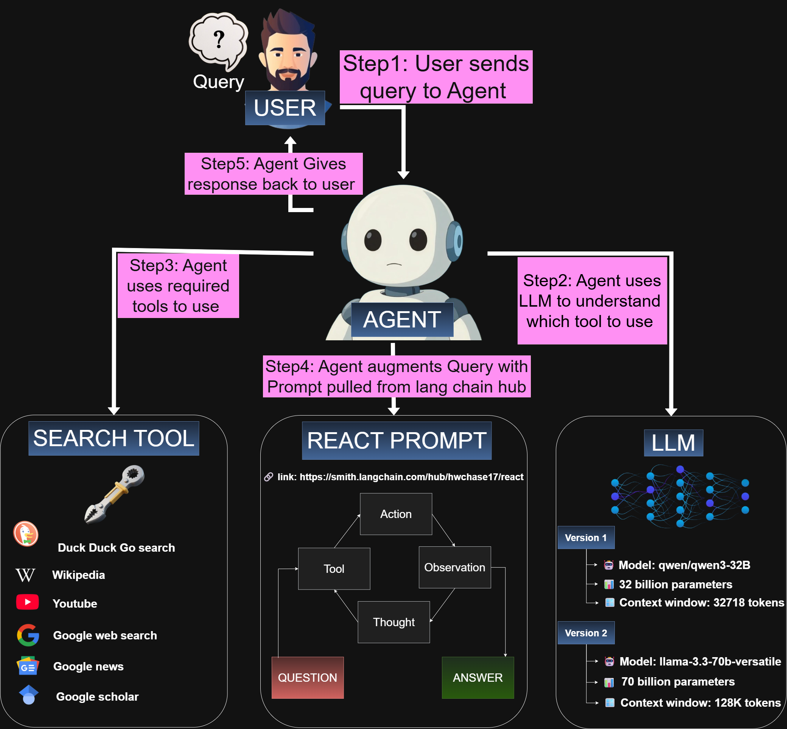

# AI Search Agent with LangChain 🤖🔍



An intelligent search agent built with LangChain that combines multiple search tools and large language models to provide comprehensive answers to user queries by searching across various platforms including DuckDuckGo, Wikipedia, YouTube, Google Web Search, Google News, and Google Scholar.

## 📋 Table of Contents

- [Overview](#overview)
- [Features](#features)
- [Architecture](#architecture)
- [Installation](#installation)
- [Configuration](#configuration)
- [Usage](#usage)
- [Project Structure](#project-structure)
- [Available Tools](#available-tools)
- [LLM Models](#llm-models)
- [Examples](#examples)

## 🎯 Overview

This project implements an AI-powered search agent using LangChain framework that intelligently selects and uses appropriate search tools based on user queries. The agent leverages ReAct (Reasoning and Acting) prompting to determine which tools to use and how to synthesize information from multiple sources.

### How It Works

1. **User Query**: User sends a natural language query to the agent
2. **LLM Reasoning**: Agent uses LLM to understand which tools are needed
3. **Tool Execution**: Agent executes the selected search tools
4. **Prompt Augmentation**: Results are combined with ReAct prompt from LangChain Hub
5. **Response Generation**: Agent synthesizes information and returns comprehensive answer

## ✨ Features

- 🔍 **Multi-Source Search**: Searches across different platforms
- 🧠 **Intelligent Tool Selection**: Automatically chooses appropriate tools based on query context
- 📺 **YouTube Content Analysis**: Fetches and analyzes YouTube video transcripts
- 📚 **Wikipedia Integration**: Quick access to encyclopedia content
- 🗞️ **News Aggregation**: Latest news from Google News
- 🎓 **Academic Search**: Scholarly articles via Google Scholar
- 🔄 **Multiple LLM Support**: Works with both Llama 3.3 70B and Qwen 3 32B models
- ⚡ **Streaming Responses**: Real-time verbose output for debugging

## 🏗️ Architecture
```
┌─────────────┐
│    USER     │
└──────┬──────┘
       │
       ▼
┌─────────────────────────────────┐
│      LangChain Agent            │
│  ┌─────────────────────────┐    │
│  │   LLM (Groq)            │    │
│  │  - llama-3.3-70b        │    │
│  │  - qwen/qwen3-32b       │    │
│  └─────────────────────────┘    │
│                                 │
│  ┌─────────────────────────┐    │
│  │   ReAct Prompt          │    │
│  │   (hwchase17/react)     │    │
│  └─────────────────────────┘    │
│                                 │
│  ┌─────────────────────────┐    │
│  │   Search Tools          │    │
│  │  - DuckDuckGo           │    │
│  │  - Wikipedia            │    │
│  │  - YouTube              │    │
│  │  - Google Web           │    │
│  │  - Google News          │    │
│  │  - Google Scholar       │    │
│  └─────────────────────────┘    │
└─────────────────────────────────┘
```

## 🚀 Installation

### Prerequisites

- Python
- Google Colab (optional, but recommended)
- API Keys for:
  - Groq (for LLM access)
  - SearchAPI.io (for Google searches)

### Setup

1. **Clone the repository**
```bash
git clone https://github.com/SyedNajiullah/langchain-search-agent.git
cd SearchAgentUsingLangchain
```

2. **Install dependencies**
```bash
pip install -qU langchain-groq
pip install -U ddgs
pip install -qU duckduckgo-search langchain-community
pip install -qU langchain-community wikipedia
pip install -qU youtube_search
pip install -qU youtube-transcript-api
pip install pytube
pip install -qU langchain-classic
```

3. **Set up environment variables**

Create a `.env` file in the root directory or pass te api key direceltly when the function is called (done in this project):
```env
GROQ_API_KEY=your_groq_api_key_here
SEARCHAPI_API_KEY=your_searchapi_key_here
```

## ⚙️ Configuration

### API Keys

#### Groq API Key
1. Visit [Groq Console](https://console.groq.com/)
2. Sign up for an account
3. Navigate to API Keys section
4. Generate a new API key
5. Copy the key to your `.env` file

#### SearchAPI.io Key
1. Visit [SearchAPI.io](https://www.searchapi.io/)
2. Sign up for a free account
3. Get your API key from dashboard
4. Add to `.env` file

### Selecting LLM Model

The project includes two versions:

**Version 1: Qwen 3 32B**
```python
llm = ChatGroq(
    model="qwen/qwen3-32b",
    api_key="your_api_key"
)
```
- 32 billion parameters
- Context window: 32718 tokens
- Faster inference, good for most queries

**Version 2: Llama 3.3 70B**
```python
llm = ChatGroq(
    model="llama-3.3-70b-versatile",
    api_key="your_api_key"
)
```
- 70 billion parameters
- Context window: 128K tokens
- Best for complex reasoning tasks

## 💻 Usage

### Basic Usage
```python
from langchain_groq import ChatGroq
from langchain_classic.agents import initialize_agent
from langchain_classic import hub

# Initialize LLM
llm = ChatGroq(
    model="llama-3.3-70b-versatile",
    api_key="your_api_key"
)

# Load tools (see notebook for tool setup)
tools = [...]

# Get ReAct prompt
prompt = hub.pull("hwchase17/react")

# Create agent
agent = initialize_agent(
    tools=tools,
    llm=llm,
    prompt=prompt,
    verbose=True
)

# Run query
response = agent.run("What are the latest developments in AI?")
print(response)
```

### Advanced Usage

#### Custom YouTube Search with Token Limits
```python
@tool(
    "youtube_search",
    description="Search YouTube and return SHORT summaries"
)
def fetch_youtube_content(query: str) -> str:
    youtube_tool = YouTubeSearchTool()
    raw_result = youtube_tool.run(query)
    video_ids = ast.literal_eval(raw_result)
    
    # Limit to 2 videos, 1500 chars each
    links = list(video_ids)[:2]
    chunks = []
    
    for i, link in enumerate(links, start=1):
        loader = YoutubeLoader.from_youtube_url(link, add_video_info=False)
        docs = loader.load()
        text = docs[0].page_content[:1500]
        chunks.append(f"Video {i} ({link}):\n{text}")
    
    return "\n\n".join(chunks)[:4000]
```

## 📁 Project Structure
```
langchain-search-agent/
│
├── SearchAIusingLLAMAVersion2.ipynb    # Llama 3.3 70B implementation
├── SearchAIusingQWENVersion1.ipynb     # Qwen 3 32B implementation
├── README.md                           # This file
```

## 🛠️ Available Tools

### 1. DuckDuckGo Search
```python
from langchain_community.tools import DuckDuckGoSearchRun
tools.append(DuckDuckGoSearchRun())
```
- General web search
- Privacy-focused
- No API key required

### 2. Wikipedia
```python
from langchain_community.tools import WikipediaQueryRun
from langchain_community.utilities import WikipediaAPIWrapper
wikiSearch = WikipediaQueryRun(api_wrapper=WikipediaAPIWrapper())
```
- Encyclopedia content
- Reliable factual information
- Structured data

### 3. YouTube Search
```python
@tool("youtube_search")
def fetch_youtube_content(query: str) -> str:
    # Returns video transcripts
    pass
```
- Video transcript analysis
- Content summarization
- Limited to prevent token overflow

### 4. Google Web Search
```python
google_web = SearchApiAPIWrapper(
    searchapi_api_key=API_KEY,
    engine="google"
)
```
- Comprehensive web search
- Latest indexed content

### 5. Google News
```python
google_news = SearchApiAPIWrapper(
    searchapi_api_key=API_KEY,
    engine="google_news"
)
```
- Latest news articles
- Real-time updates
- Multiple sources

### 6. Google Scholar
```python
google_scholar = SearchApiAPIWrapper(
    searchapi_api_key=API_KEY,
    engine="google_scholar"
)
```
- Academic papers
- Research articles
- Citations and references

## 🤖 LLM Models

### Model Comparison

| Feature | Llama 3.3 70B | Qwen 3 32B |
|---------|---------------|------------|
| Parameters | 70 billion | 32 billion |
| Context Window | 128K tokens | 32K tokens |
| Speed | Moderate | Fast |
| Best For | Complex reasoning | Quick queries |
| Cost | Higher | Lower |

### Choosing a Model

- **Use Llama 3.3 70B** for:
  - Complex multi-step reasoning
  - Long context requirements
  - Detailed analysis tasks

- **Use Qwen 3 32B** for:
  - Quick searches
  - Standard queries
  - Cost-sensitive applications

## 📊 Examples

### Example 1: News Search
```python
response = agent.run("What are the top AI news stories today?")
```

### Example 2: Academic Research
```python
response = agent.run("Latest research papers on transformer models")
```

### Example 3: YouTube Content Discovery
```python
response = agent.run("Best videos to understand LangChain")
```

### Example 4: Multi-Source Query
```python
response = agent.run("Top news in AI using DuckDuckGo and Wikipedia")
```
